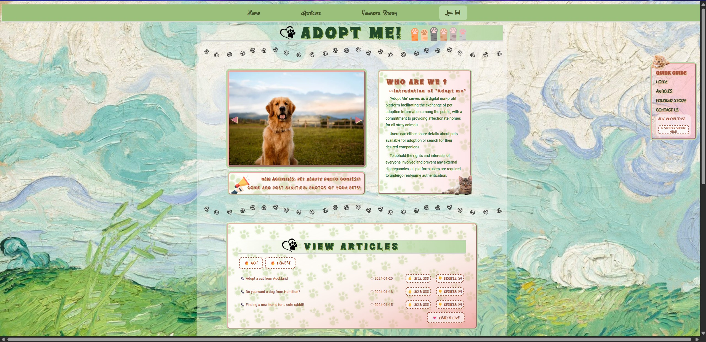

# **Adopt Me** A personal blogging system



**Adopt Me** is a responsive full-stack web application that allows users to post and browse articles about adopting animals. The platform combines blogging functionality with social interactions (likes, comments, and profiles), creating a community-driven adoption hub.

## Key Features
- **User Authentication:**  Sign up, log in, and manage user sessions with JWT.
- **Blogging System:**  Create, edit, and delete adoption-related articles.
- **Commenting System:**  Add and manage comments on posts.
- **Like Functionality:**  Engage with posts through likes.
- **User Profiles:**  Personalized profiles with stored user data.
- **Responsive Frontend:**  Built with SvelteKit for seamless UI/UX.
- **Persistent Database:**  SQLite database with schema migrations.
- **RESTful API Backend:**  Express.js APIs for authentication, posts, comments, and profiles.
- **Secured Passwords:**  User passwords hashed with bcrypt.
- **Form Validation:**  Yup schema validation for cleaner user input.
- **Logging & Monitoring:**  Morgan integrated for request logging.

## Tech Stacks & Packages
 ### Frontend:
- **SvelteKit:**  UI Framework
- **TailwindCSS:**  For styling
- **ESLint & Prettier:**  Code formating and linting

### Backend:
- **Express.js:**  Web Framework
- **SQLite3:**  Lightweight Relational Database System
- **bcrypt:**  Password Hashing and Salting
- **JWT:**  Authentication
- **Yup:**  Schema Validation
- **Morgan:**  Request logging
- **CORS:**  Cross-origin resource sharing

## Functions & Modules
- **Authentication (api-auth.js, auth-middleware.js):**  Handles login, signup, JWT authentication.
- **User Management (api-users.js, userprofile.js):**  Manages user accounts and profiles.
- **Articles (api-articles.js, getArticlelink.js):**  CRUD operations for blog posts.
- **Comments (api-comments.js):**  Comment creation and retrieval.
- **Likes (api-likes.js):**  Like/unlike functionality.
- **Database (database.js, init-db.sql):**  Handles database initialization and queries and then connect databse to backend structure.
- **Utilities (jwt-utils.js):**  Token signing and verification.

## Setting Up the Project
### 1. Clone the Repository

```bash
git clone https://github.com/ZedZed34/Adopt-me.git
cd Adopt-me
```

### 2. Setting Up Frontend

```bash
cd frontend
npm install
npm run dev
```

### 3. Setting Up Backend

```bash
cd brontend
npm init -y
npm install
npm install express sqlite3 bcrypt cors yup morgan cookie-parser
npm run dev
```

### 4. Sample User for Login

```bash
Username: EchoMa
Password: welcome
```

## Keywords
**Adopt Me, Pet Adoption, Animal Adoption, Blogging Platform, Full Stack Project, SvelteKit, Express.js, SQLite, JWT Authentication, Community Platform**